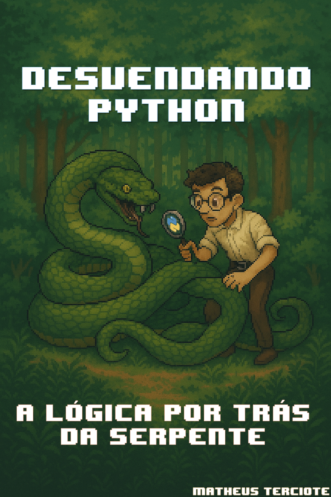

# Projeto Prompts para Criar um EBOOK

 > ℹ️ **NOTE:** Este repositório foi elaborado durante o Bootcamp promovido pelo Santander na [DIO](https://dio.me) como um desafio proposto pelo professor [Felipe Aguiar](https://github.com/felipeAguiarCode)

O projeto surge como um desafio proposto durante o bootcamp, visando a criação de um ebook digital através da utilização das mais avançadas ferramentas de Inteligência Artificial. Abaixo, encontram-se listados os prompts que nortearão o desenvolvimento deste projeto.

<a href="https://github.com/mterci/prompts-recipe-to-create-a-ebook/blob/main/output/ebook-python.pdf" title="View PDF now"> 📕Clique aqui para ler</a>

## 💻 Tecnologias utilizadas no projeto

- [ChatGPT](https://chat.openai.com/) 
- [Copilot](https://copilot.microsoft.com/)
- [PowerPoint](https://www.microsoft.com/en/microsoft-365/powerpoint)

## 🧙🏻‍♀️ Prompts 

ChatGPT：

|   Ação   | prompt                                                                                                                                                                                                                                                                         |
| :------: | ------------------------------------------------------------------------------------------------------------------------------------------------------------------------------------------------------------------------------------------------------------------------------ |
|  título  | crie um titulo de um ebook sobre o tema de python, o ebook é do nicho de programação e do subnicho de python, o título deve ser cativante e curto, e que tenha uma jogada mais nerd       
| conteúdo | faça um texto para ebook, com foco em Python, limitando os principais seletores Python com exemplos em código

(REGRAS)
- explique sempre de uma maneira simples
- deixe o texto enxuto
- sempre traga exemplos de códigos em contextos reais
- sempre deixe um título sugerido por tópico |

Copilot：

|  Ação  | prompt                                                                                 |
| :----: | -------------------------------------------------------------------------------------- |
| título | create an image of an enormous snake in the forest being unraveled by a nerd with glasses and a magnifier, pixel art style |

## ✨ Features

- Conteúdo gerado via ChatGPT
- Imagens geradas via Copilot

## 📚 Materiais

- Imagens utilizadas em `assets`
- Ebook em `output`

## 🛠️ Instruções de execução

Empregue os prompts mencionados utilizando as ferramentas recomendadas para gerar o conteúdo base e utilize um software de edição de documentos, como o PowerPoint, para realizar a diagramação e edição.

